```{r setup, include=FALSE}
knitr::opts_chunk$set(echo = FALSE, message = FALSE, warning = FALSE)
options(knitr.kable.NA = '<no response>')

```


<style>
div.vert pre { 
  white-space: pre !important;
  overflow-y: scroll !important;
  height: 20vh !important;
}

div.vert pre.r { 
  overflow-y: hidden !important;
  height: auto !important;
}


</style>


<style>
  .col2 {
    columns: 2 200px;         /* number of columns and width in pixels*/
    -webkit-columns: 2 200px; /* chrome, safari */
    -moz-columns: 2 200px;    /* firefox */
  }
  .col3 {
    columns: 3 100px;
    -webkit-columns: 3 100px;
    -moz-columns: 3 100px;
  }
</style>


```{r echo=FALSE}
#packages and load dataset
require('kableExtra')
load('filelist2.RData')
```

<br>
<br>


## **About the PRIME-DE Global Collaboration Workshop**


<br>

To accelerate the pace of advancement, the PRIMatE Data Exchange (PRIME-DE) was recently established to promote a culture of collaboration and open science in the nonhuman primate (NHP) neuroimaging community. Towards this goal, PRIME-DE established a [repository](https://doi.org/10.1016/j.neuron.2018.08.039) of openly shared data in 2017, and more recently, the PRIME-DE [Global Collaboration Workshop (GCW)](http://fcon_1000.projects.nitrc.org/indi/PRIME/Workshop_reg.html), which will take place in London at the Wellcome Trust on September 5th and 6th. 

In preparation for the GCW, PRIME-DE distributed a request for information regarding challenges and practices in the NHP imaging community. The survey questions were generated by GCW session co-leaders to probe commonly cited concerns among NHP researchers, though there was also an opportunity to share any questions or areas of concern not included in the survey.  

Here, we are happy to share the results of the PRIME-DE Request for Information. Our hope is that the information provided will help to guide future discussions among investigators and stakeholders, as well as facilitate priority setting.

<br>

- - - 

<br>

## **Survey Results**


<br>

### I) Standardized Paradigm Design

<br>

#### If we were to collectively set up a short video movie for use as a common multimodal localizer paradigm across sites:


<br>

#### Q1: What elements do you believe are most essential for inclusion in such a movie stimulus (e.g., conspecific individuals, faces, bodies, social and non-social, interactions, vocalizations, other sounds...)?


```{r}
kable(filelist2[['design_01']]) %>%
  kable_styling(bootstrap_options = c("striped", "hover")) %>%
  column_spec(1, width = "2em", bold = F, italic = TRUE) %>%
  scroll_box(width = "100%", height = "250px") 

```
<center>
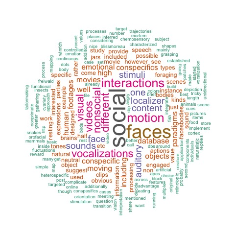
</center>


- - -


<br>


#### Q2: How would you order these elements based on priority?


```{r}


kable(filelist2[['design_02']]) %>%
  kable_styling('striped', 'hover') %>%
  column_spec(1, width = "2em", bold = F, italic = TRUE) %>%
  scroll_box(width = "100%", height = "250px") 
  
```

<center>
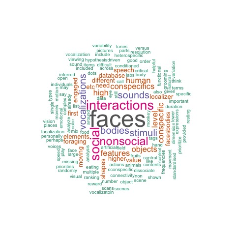
</center>


- - -
<br>


### II) Data Standards, Quality Assessments and Analytic Softwares

<br>

#### Q1: What software package(s) do you use for data analysis?


```{r}


kable(filelist2[['data_01']]) %>%
  kable_styling('striped', 'hover') %>%
  column_spec(1, width = "2em", bold = F, italic = TRUE) %>%
  scroll_box(width = "100%", height = "250px") 
  


```


<center>
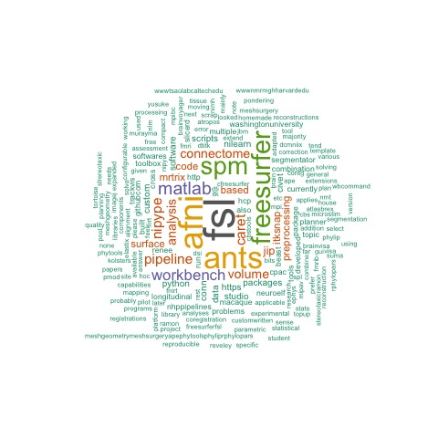
</center>


- - -
<br>

#### Q2: What hacks were required to make these packages work for NHP data?

```{r}

kable(filelist2[['data_02']]) %>%
  kable_styling('striped', 'hover') %>%
  column_spec(1, width = "2em", bold = F, italic = TRUE) %>%
  scroll_box(width = "100%", height = "250px") 
  
```

<center>
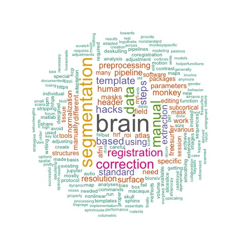
</center>


- - -
<br>

#### Q3: What are the main problems (preprocessing, analyses) that you run into and that the community needs to solve for NHP data?

```{r}


kable(filelist2[['data_03']]) %>%
  kable_styling('striped', 'hover') %>%
  column_spec(1, width = "2em", bold = F, italic = TRUE) %>%
  scroll_box(width = "100%", height = "250px") 
  


```

<center>
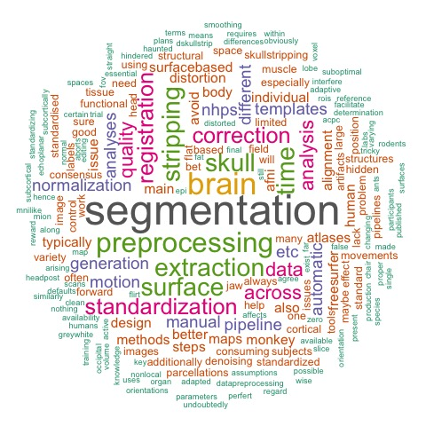
</center>


- - -
<br>

#### Q4: Do you rely primarily on volume or surface-based approaches for inter-subject registration? Is there a particular reason as to why?

```{r}


kable(filelist2[['data_04']]) %>%
  kable_styling('striped', 'hover') %>%
  column_spec(1, width = "2em", bold = F, italic = TRUE) %>%
  scroll_box(width = "100%", height = "250px") 
  
```

<center>

</center>


- - -
<br>

### III) Standardizing Data Collection Protocols
<br>

#### Q1: What type of scanner and head coil(s) does your work rely on? Are there any specific advantages?

```{r}


kable(filelist2[['stand_01']]) %>%
  kable_styling('striped', 'hover') %>%
  column_spec(1, width = "2em", bold = F, italic = TRUE) %>%
  scroll_box(width = "100%", height = "250px") 
  


```

<center>
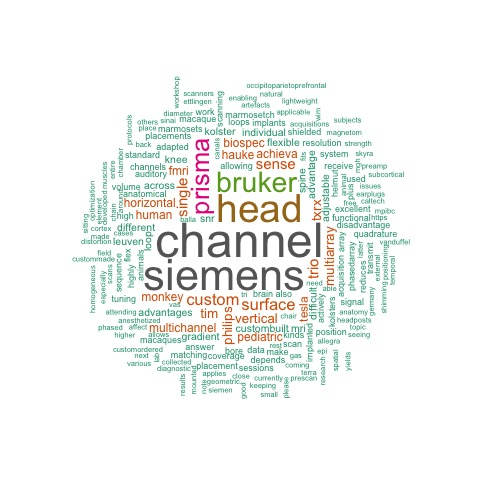
</center>


- - -
<br>

#### Q2: What image sequence types do you obtain in all studies? (e.g., T1W, T2W, dMRI, fMRI, field map); for each modality, what spatial resolution and (if used) multi-band factor?

```{r}


kable(filelist2[['stand_02']]) %>%
  kable_styling('striped', 'hover') %>%
  column_spec(1, width = "2em", bold = F, italic = TRUE) %>%
  scroll_box(width = "100%", height = "250px") 
  


```

<center>
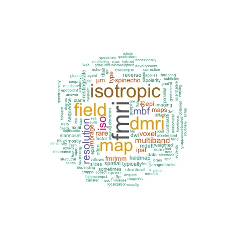
</center>


- - -
<br>

#### Q3: Are you using MION or other iron-based contrast agents? If so, what specific agent and dose?

```{r}


kable(filelist2[['stand_03']]) %>%
  kable_styling('striped', 'hover') %>%
  column_spec(1, width = "2em", bold = F, italic = TRUE) %>%
  scroll_box(width = "100%", height = "250px") 
  


```

<center>
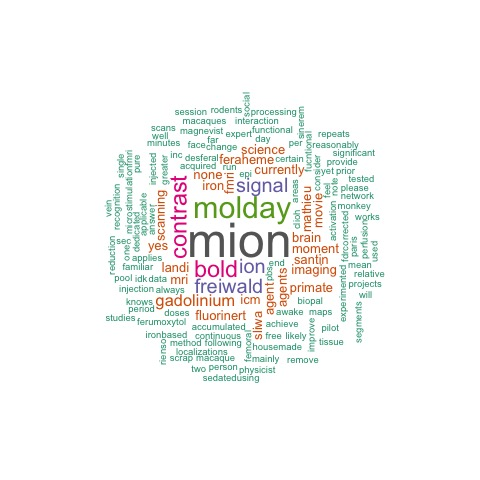
</center>

- - -
<br>

#### Q4: If you use anesthesia, what specific type and levels do you use?

```{r}


kable(filelist2[['stand_04']]) %>%
  kable_styling('striped', 'hover') %>%
  column_spec(1, width = "2em", bold = F, italic = TRUE) %>%
  scroll_box(width = "100%", height = "250px") 
```

<center>
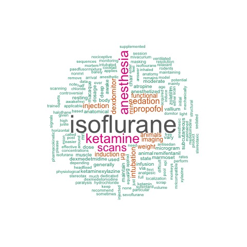
</center>
- - -
<br>

#### Q5: What protocols have you applied to do awake imaging (e.g., Do you obtain eye-tracking in the scanner? What physiologic measures?)?

```{r}


kable(filelist2[['stand_05']]) %>%
  kable_styling('striped', 'hover') %>%
  column_spec(1, width = "2em", bold = F, italic = TRUE) %>%
  scroll_box(width = "100%", height = "250px") 
  
```

<center>

</center>

- - -
<br>

#### Q6: What protocols are you using to optimize various acquisition parameters? Or rather, what are the tools and parameters you use to assess the quality of your acquisition?

```{r}


kable(filelist2[['stand_06']]) %>%
  kable_styling('striped', 'hover') %>%
  column_spec(1, width = "2em", bold = F, italic = TRUE) %>%
  scroll_box(width = "100%", height = "250px") 
  
```

<center>
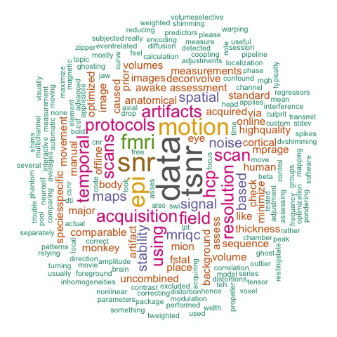
</center>


- - -
<br>

#### Q7: What acquisition standards do you feel are required for surface-based or volume based processing and registration?

```{r}


kable(filelist2[['stand_08']]) %>%
  kable_styling('striped', 'hover') %>%
  column_spec(1, width = "2em", bold = F, italic = TRUE) %>%
  scroll_box(width = "100%", height = "250px") 
  
```

<center>
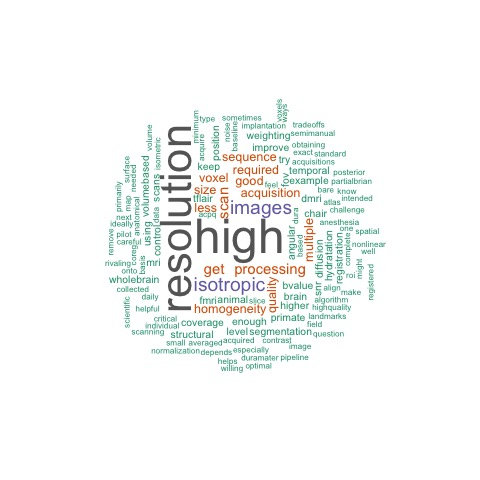
</center>

- - -
<br>

#### Q8: What do you use for distortion correction and acquisition for Mion vs BOLD sequences?

```{r}


kable(filelist2[['stand_09']]) %>%
  kable_styling('striped', 'hover') %>%
  column_spec(1, width = "2em", bold = F, italic = TRUE) %>%
  scroll_box(width = "100%", height = "250px") 
  


```

<center>
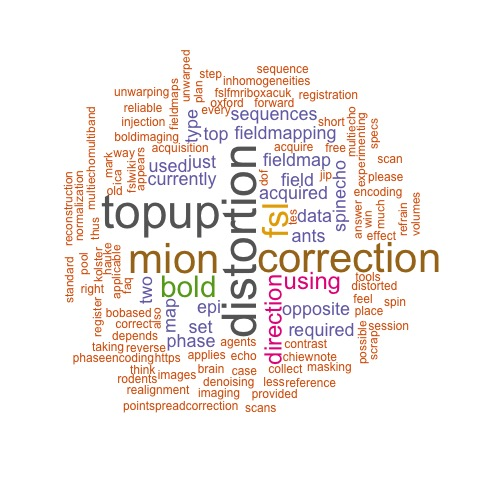
</center>

- - -
<br>

#### Q9: What would you like to see as a 'standard' for acquisition sequences across community and PRIME contributors?

```{r}


kable(filelist2[['stand_10']]) %>%
  kable_styling('striped', 'hover') %>%
  column_spec(1, width = "2em", bold = F, italic = TRUE) %>%
  scroll_box(width = "100%", height = "250px") 
  
```

<center>
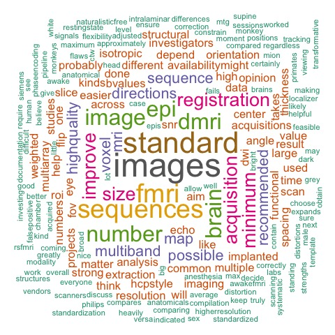
</center>

- - -
<br>

#### Q10: If you would like to provide any additional suggestions or information, please do so here. 

```{r}


kable(filelist2[['additional']]) %>%
  kable_styling('striped', 'hover') %>%
  column_spec(1, width = "2em", bold = F, italic = TRUE) %>%
  scroll_box(width = "100%", height = "250px") 

```

<center>

</center>

- - -
 
### Download

You can download an Excel spreadsheet with the survey responses [here](https://github.com/hotavocado/PRIME-info-request/blob/master/PRIME_survey_reponses.xlsx).

<br>


